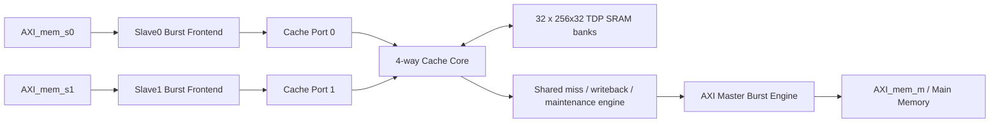

# 基于 AXI 总线接口的二级 Cache 详细设计方案

## 1. 文档信息

| 项目 | 内容 |
| --- | --- |
| 作品名称 | 基于 AXI 总线接口的二级 Cache |
| RTL 顶层 | `rtl/axi_l2_cache.sv` 中的 `axi_l2_cache` |
| RTL 语言 | SystemVerilog |
| Cache 容量 | 32KB |
| Cache 组织 | 4-way，256 sets，32B/line |
| AXI 数据位宽 | 32bit |
| 文档版本 | v0.1 |
| 日期 | 2026-07-14 |

本设计依据竞赛官方命题页面及其评分表实现。官方页面：
[“华为杯”第五届中国研究生创“芯”大赛——京微齐力企业命题](https://cpipc.acge.org.cn/cw/contestNews/detail/10/2c9080157f918b5d017fa78888070a1d?page=9)。

## 2. 需求分析

### 2.1 功能目标

设计需要同时满足以下关键能力：

1. 两个 AXI Slave 接收处理器或上游主设备的 Cache 空间访问。
2. 一个 AXI Master 访问主存，完成 line refill、dirty eviction、write-through 和 bypass。
3. 32KB、32B Cache line、四路组相联。
4. 写回与写穿运行时选择。
5. 读分配、写分配分别使能。
6. LRU 与 LFU 替换算法运行时选择。
7. clear 和 flush 按 KB 地址范围执行。
8. 两个 Slave 同时访问不同 Cache line。
9. FPGA 目标 100MHz，ASIC 约束目标 500MHz。

### 2.2 评分导向

评分表中，双 Slave 并发占 50 分；写模式、分配策略和替换策略的“双模式同时支持”各包含 30 分项。因此本设计没有采用只能静态编译选择策略的方案，而是保留 `Wr_mode`、`Rd_alct_en`、`Wr_alct_en`、`replace_mode` 运行时控制。

同分时资源使用少者优先。设计将 32KB 数据体存放在显式 SRAM wrapper 中，控制状态与 tag/meta 分离，便于 FPGA BRAM 推断和 ASIC SRAM macro 替换。

## 3. 总体架构



设计分为三条逻辑路径：

- 命中快路径：两个端口独立查 tag、读取 SRAM，并在不同 line 时同周期返回。
- 慢路径：miss、write-through、no-allocate 和 bypass 进入共享主存事务引擎。
- 维护路径：clear/flush 扫描 1024 个 way/set 目录项，并在 flush 时写回 dirty line。

## 4. Cache 组织与地址划分

容量计算：

```text
4 ways * 256 sets * 32 bytes/line = 32768 bytes = 32KB
32 bytes/line / 4 bytes/word = 8 words/line
```

地址字段：

| 地址位 | 字段 | 说明 |
| --- | --- | --- |
| `[31:13]` | Physical tag | 19bit 物理 tag |
| `[12:5]` | Set index | 256 sets |
| `[4:2]` | Word offset | 每 line 8 个 32bit word |
| `[1:0]` | Byte offset | 字节位置 |

`adr_start`、`adr_end` 使用 KB 为单位。只有满足以下条件的访问才进入 Cache：

```text
Cache_en == 1
adr_start <= address[31:10] <= adr_end
address[31:10] - adr_start < 262144KB
```

最后一项将有效连续映射范围限制为最大 256MB。实现保存完整物理 tag，而不是保存相对 `adr_start` 的 tag。该选择增加少量 tag bit，但避免命中路径上的基地址减法，有利于高频实现。

## 5. 模块设计

| 模块 | 源文件 | 功能 |
| --- | --- | --- |
| `axi_l2_cache` | `rtl/axi_l2_cache.sv` | 顶层接口与子模块连接 |
| `axi_cache_slave_port` | `rtl/axi_cache_slave_port.sv` | AXI Burst 转换为逐 word Cache 请求 |
| `cache_core` | `rtl/cache_core.sv` | tag 查找、策略、双口并发和维护状态机 |
| `axi_master_engine` | `rtl/axi_master_engine.sv` | 单 word 或 8-beat line 主存事务 |
| `cache_sram_tdp` | `rtl/cache_sram_tdp.sv` | 双端口、字节写使能 SRAM 行为模型 |

### 5.1 AXI Slave 前端

每个 Slave 前端独立处理一个 Burst：

1. 接收 AR 或 AW，读地址优先于同周期写地址。
2. 将 Burst 拆分为逐 beat 请求。
3. 等待 Cache core 返回后再处理下一 beat。
4. 生成 `RID/RDATA/RRESP/RLAST` 或 `BID/BRESP`。

支持 FIXED、INCR、WRAP 地址生成。当前数据访问限定为 32bit 对齐；非法 burst type、非 32bit size 或未对齐地址返回 `SLVERR`。

### 5.2 AXI Master 引擎

主存引擎一次接受一个内部命令：

| 命令 | AWLEN/ARLEN | 用途 |
| --- | --- | --- |
| 单 word read/write | 0 | bypass、no-allocate、write-through |
| 32B line read/write | 7 | refill、dirty eviction、flush |

line 事务固定为 8 个 32bit INCR beats。引擎检查 `BRESP/RRESP` 和 `RLAST`，错误返回 Cache core。

## 6. 双端口并发设计

数据体按 `4 ways x 8 word banks` 划分为 32 个 `256x32` 双端口 SRAM：

```text
每个 bank 容量 = 256 sets * 32bit = 1KB
32 banks * 1KB = 32KB
```

端口 A 对应 Slave0，端口 B 对应 Slave1。两个请求满足以下条件时可以同周期完成：

- 都是 Cache hit；
- 访问不同 Cache line；
- 没有与当前 refill/eviction 的锁定 set 冲突；
- 两个响应缓冲均可接受结果。

即使两个地址映射到同一个 set，只要 tag 不同并命中不同 way，也能通过两个 SRAM 端口并行返回。对同一 line 的同时访问进行串行化，避免读写顺序和 byte merge 歧义。

miss 由共享引擎串行处理，但另一个端口仍允许命中不同 set，形成有限的 hit-under-miss 能力。

## 7. 读写与分配策略

### 7.1 写回模式

`Wr_mode=1`：

- 写命中只更新 SRAM 并设置 dirty。
- 写缺失且 `Wr_alct_en=1` 时先 refill，再 merge `WSTRB` 数据并设置 dirty。
- victim dirty 时先执行 8-beat writeback。

### 7.2 写穿模式

`Wr_mode=0`：

- 写命中更新 SRAM 后执行主存单 word write。
- 写分配 miss 完成 refill 和 byte merge 后，再同步写主存。
- 如果从写回切换到写穿时命中的 line 已经 dirty，则写回更新后的完整 line，防止其他 dirty word 丢失。

### 7.3 分配控制

| 操作 | 分配使能 | miss 行为 |
| --- | --- | --- |
| Read | `Rd_alct_en=1` | 读取完整 32B line 并安装 |
| Read | `Rd_alct_en=0` | 直接读取目标 word，不安装 |
| Write | `Wr_alct_en=1` | refill、merge、按写模式处理 |
| Write | `Wr_alct_en=0` | 直接写主存，不安装 |

`Cache_en=0` 或地址不在有效窗口时同样走 bypass 单 word 路径。

## 8. 替换策略

### 8.1 LRU

`replace_mode=1`。每个 set 使用 16bit 访问时戳，每个 way 保存最后访问时戳。替换时选择最小值。两个端口同时命中同一 set 时，按 Port0、Port1 顺序分配连续时戳。

### 8.2 LFU

`replace_mode=0`。每个 way 使用 8bit 饱和访问计数器：

- refill 安装时置 1；
- 每次 hit 增加 1；
- 达到 `8'hff` 后保持饱和；
- 替换选择最小计数值。

两种算法均优先选择 invalid way，只有四路全部有效时才比较元数据。

## 9. clear、flush 与复位

### 9.1 clear

`Cache_clr` 脉冲启动。扫描 line 的物理 KB 地址，命中 `[clr_adr_start, clr_adr_end]` 范围时清除 valid 和 dirty，不写回主存。

### 9.2 flush

`Cache_flush` 脉冲启动。范围内 clean line 直接失效；dirty line 先通过 8-beat Burst 写回，再失效。`maint_error` 记录维护期间的 AXI 错误。

### 9.3 复位初始化

复位后维护引擎扫描全部 `4*256=1024` 个目录项并失效。设计没有在单个时钟沿并行复位所有 SRAM 和 tag 元数据，避免形成大规模复位网络。初始化期间 `maint_busy=1`，Slave 请求被反压。

## 10. 错误处理

- Slave 不支持的 size、burst 或未对齐地址返回 `SLVERR`。
- refill 读错误时不安装 Cache line，并向请求端返回 `SLVERR`。
- dirty eviction 写错误时保留原 dirty line，不执行覆盖。
- write-through 写错误时将对应 line 标为 dirty，保留最新 Cache 数据并返回 `SLVERR`。
- flush 写回错误置 `maint_error`，该 line 保持有效，扫描继续。

## 11. 频率与物理实现

### 11.1 FPGA 100MHz

`constraints/fpga_100mhz.sdc` 定义 10ns 时钟周期。Icarus testbench 同样使用 10ns 时钟，但这只验证功能时序，不等于 FPGA timing closure。

P1/Fuxi 实现需要进一步完成：

1. 确认 `cache_sram_tdp` 推断为目标器件双端口 RAM。
2. 根据 P1 器件型号、时钟引脚和 IO 分配补充约束。
3. 运行综合、布局布线并保存资源和时序报告。
4. 使用 DDR3 AXI 参考设计连接 `AXI_mem_m`。

`scripts/fpga_yosys_synth.ys` 可用于第三方环境中的通用 RTL 综合预检，但不能代替 P1/Fuxi 的器件映射和时序实现。

### 11.2 ASIC 500MHz

`constraints/asic_500mhz.sdc` 定义 2ns 周期和 0.1ns clock uncertainty。达到 500MHz 需要：

- 使用工艺库 SRAM macro 替换行为模型；
- 对 tag lookup、victim select 和响应 mux 做 STA；
- 必要时把组合 tag 查找拆成流水级；
- 完成综合、STA、DRC/LVS 和 PVT 多角分析。

当前没有 ASIC 库、综合报告或 STA 报告，因此本文不宣称 500MHz 已经实现。
`scripts/asic_dc_synth.tcl` 提供 Design Compiler 流程模板，要求外部设置工艺库目录和 target library。

## 12. 验证摘要

Icarus Verilog 12.0 仿真已覆盖：

- read-allocate miss 和 hit；
- write-back、flush、write-through、`WSTRB`；
- clear；
- read/write no-allocate；
- Cache bypass；
- LRU、LFU；
- 两 Slave 不同 set 和同 set 不同 line 的同周期 hit；
- 跨 Cache line 的 AXI read/write Burst。

日志：`sim/simulation.log`。结果标记：`ALL_TESTS_PASS`。

## 13. 后续提交前工作

1. 接入官方 testcase 和官方 SRAM 时序模型。
2. 根据官方端口清单增加薄 wrapper，不修改 Cache core。
3. 在 P1/Fuxi 完成 100MHz 实现并导出资源、时序、bitstream 和板级演示证据。
4. 在指定 ASIC 工艺库完成 500MHz 综合和 STA。
5. 增加 AXI 随机 backpressure、error injection 和代码覆盖率测试。
