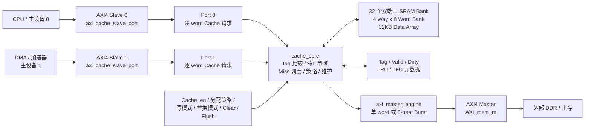
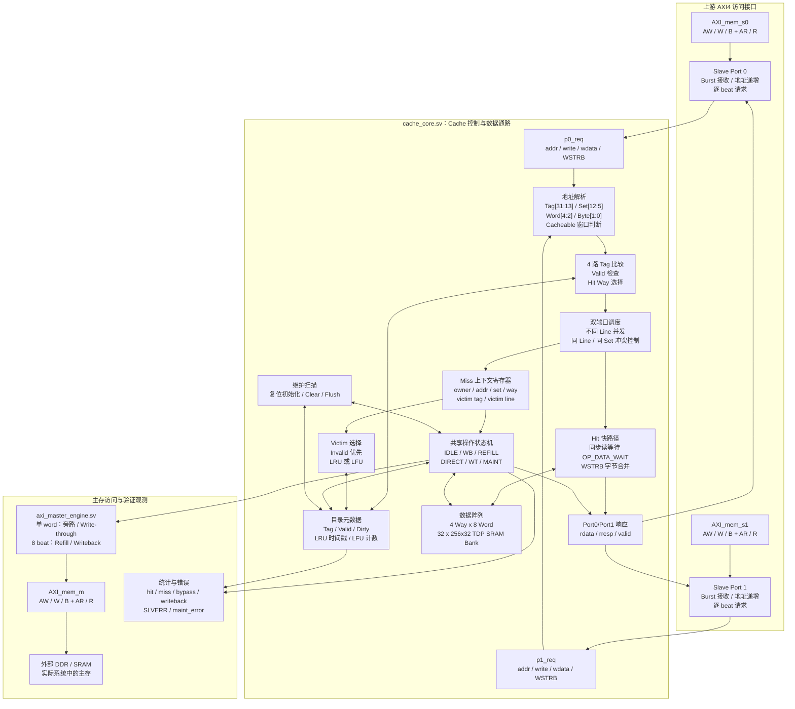
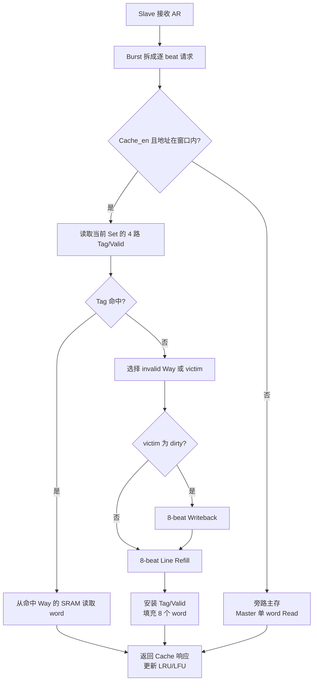
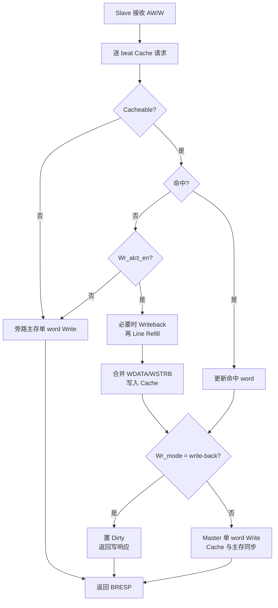
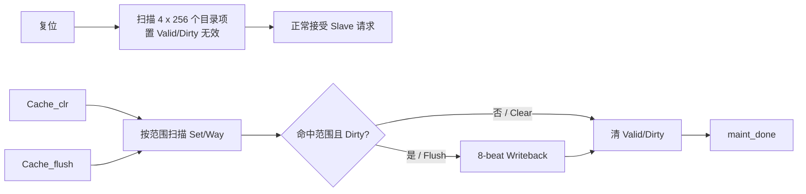
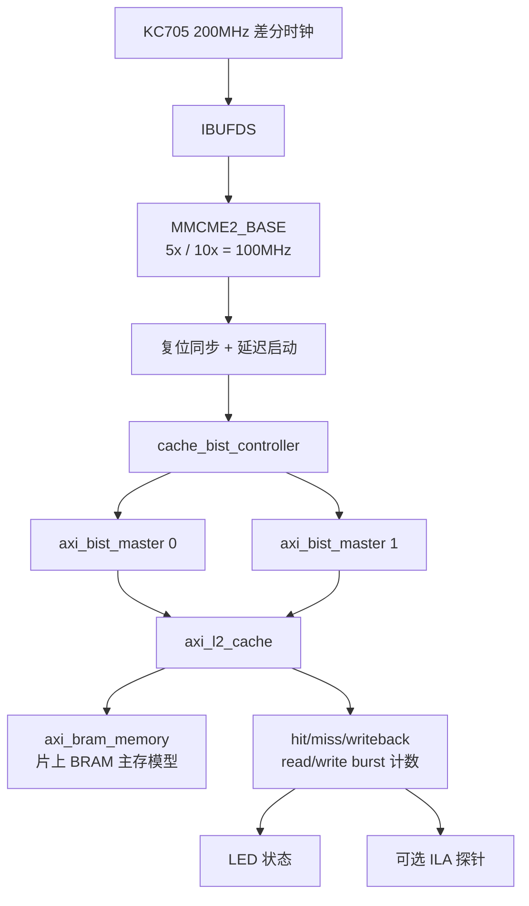

# AXICache 项目面试准备：功能、流程与总体框架

> 用途：面试时用 2～5 分钟讲清项目背景、RTL 架构、关键流程和验证结果。
> 本文以当前 `AXICache/` 工程为准，区分 RTL 已实现、仿真已验证和 FPGA 尚未闭环的内容。

## 1. 项目一句话定位

这是一个面向异构 SoC 多主设备共享访存的 32KB、四路组相联 L2 Cache IP。上游通过两个 AXI4 Slave 端口访问 Cache，下游通过一个 AXI4 Master 端口访问主存；Cache 在命中时优先由片上 SRAM 返回数据，在缺失、写穿、旁路、回写和维护操作时由共享主存事务引擎完成 AXI 访问。

面试时可以先说：

> 我负责的是一个带双上游访问端口的 L2 Cache。重点不只是把数据存进 SRAM，而是把 AXI Burst 转成 Cache 请求，完成 tag 查找、命中返回、Miss 处理、脏行回写、Line Refill 和策略控制，同时处理两个端口之间的同 Line 冲突和不同 Line 并发。

## 2. 总体框架图



### 2.1 IP 核级技术细节框图

下面这张图适合面试时从“接口信号如何进入 Cache”展开到“命中、Miss 和主存事务如何闭环”。其中带有文件名的方框对应独立 RTL 模块；`cache_core` 子图中的方框是 `cache_core.sv` 内的逻辑功能块，不代表额外的 module。



#### 图中关键接口和内部信号

| 位置 | 关键内容 | 面试时的说法 |
| --- | --- | --- |
| Slave 前端与 Core 之间 | `p0_req_*`、`p1_req_*`、`p*_rsp_*` | AXI 通道先在前端完成协议级握手，再转换成 Core 易于调度的逐 word 请求/响应接口。 |
| 地址解析 | `tag/set/word` 和 cacheable 判断 | Set 用于定位目录项，Tag 用于比较，Word offset 用于选择一行中的 8 个 word，低两位用于对齐检查。 |
| 命中路径 | `valid_mem`、`tag_mem`、`data_rdata_a/b` | 四路并行比较目录项，命中后从对应 Way 的 SRAM 端口读取数据；同步 BRAM 读需要一拍等待。 |
| Miss 上下文 | `ctx_owner`、`ctx_set`、`ctx_way`、`ctx_victim_line` | 把当前 Miss 的所有信息锁存下来，保证回写、回填和最终响应跨多个时钟周期仍引用同一请求。 |
| 主存命令 | `mem_cmd_*`、`mem_rsp_*` | Core 只产生抽象的单 word/整行命令，AXI Master Engine 负责把它编码为标准 AXI 事务。 |
| 维护路径 | `OP_MAINT_SCAN`、`OP_MAINT_WB_REQ/WAIT` | Clear/Flush 与正常请求共用元数据和主存引擎，但通过 `maint_busy` 对上游施加反压。 |

### 2.2 各层职责

| 层级 | RTL 模块 | 面试解释重点 |
| --- | --- | --- |
| AXI 接入层 | `rtl/axi_cache_slave_port.sv` | 每个 Slave 独立接收 AXI Read/Write Burst，检查 32bit 对齐传输，将每个 beat 转成一个 Cache 请求，再把响应重新组装成 AXI 响应。 |
| Cache 控制层 | `rtl/cache_core.sv` | 完成地址拆分、四路 tag 比较、命中/缺失判断、victim 选择、写策略、Miss 状态机、维护扫描和统计计数。 |
| 数据存储层 | `rtl/cache_sram_tdp.sv` | 每个 Bank 是 256x32 的真双口 SRAM 行为模型；32 个 Bank 组成 4 Way、每行 8 个 word 的数据阵列。 |
| 主存事务层 | `rtl/axi_master_engine.sv` | 接收 Cache Core 的内部命令，将旁路/写穿转换成单 beat AXI，将 Refill/Writeback 转换成 8 beat AXI Burst。一次只允许一个主存事务在途。 |
| FPGA 验证层 | `fpga/kc705/rtl/cache_fpga_bist_subsystem.sv`、`cache_bist_controller.sv` | 用两个 BIST Master 模拟两个上游主设备，用片上 `axi_bram_memory.sv` 模拟主存，并把状态、计数和错误码送到 LED/ILA。 |
| 板级顶层 | `fpga/kc705/rtl/kc705_axi_cache_top.sv` | 接收 KC705 200MHz 差分时钟，经 MMCM/BUFG 生成 100MHz Cache 时钟；处理复位同步、BIST 延迟启动、LED 状态显示和可选 ILA。 |

## 3. Cache 组织与地址理解

```text
4 ways x 256 sets x 32 bytes/line = 32KB
32 bytes/line = 8 x 32bit word
32 个数据 Bank = 4 ways x 8 word Bank
```

当前地址字段为：

| 地址位 | 字段 | 含义 |
| --- | --- | --- |
| `[31:13]` | Tag | 19bit 物理 tag |
| `[12:5]` | Set index | 256 个 Set，8bit |
| `[4:2]` | Word offset | 一行内 8 个 word，3bit |
| `[1:0]` | Byte offset | 32bit 对齐访问时为 0 |

地址是否进入 Cache 由 `Cache_en` 和 `adr_start/adr_end` 窗口共同决定，最大连续映射范围按 256MB 限制。当前实现支持 32bit 对齐、`AxSIZE=3'd2` 的 FIXED/INCR/WRAP 访问；不满足条件的事务返回 `SLVERR`。

## 4. 一次读访问的主流程



### 4.1 Read Hit

1. Slave 前端握手接收地址和控制信息。
2. Core 从地址中得到 `set/tag/word offset`，并并行比较 4 路 tag。
3. 命中后使用对应 SRAM Bank 的读数据返回目标 word。
4. 命中统计加一，并更新选定的替换元数据。

数据 SRAM 使用同步读模板，因此 RTL 中存在 `OP_DATA_WAIT`/read-pending 等等待状态；这是为了让 FPGA 工具能够把数据阵列推断成真双口 BRAM，而不是把整块存储器展开成大量 LUT 组合逻辑。

### 4.2 Read Miss

1. Core 锁存请求上下文，包括 owner、地址、Set、word offset、写数据和 `WSTRB`。
2. 先选择 invalid Way；若四路均有效，则按 `replace_mode` 选择 victim。
3. victim 为 dirty 时先读取整行并发起 8-beat Writeback。
4. Master Engine 发出 `ARLEN=7`、`ARSIZE=2`、`ARBURST=INCR` 的 32B Refill。
5. Refill 返回后填入 8 个 word；若原请求是写分配，则在目标 word 上执行 `WSTRB` merge。
6. 最后向原 Slave 返回目标 beat，并更新 valid、dirty、LRU/LFU。

## 5. 一次写访问的主流程



| 控制组合 | 行为 |
| --- | --- |
| `Wr_mode=1` | Write-back：写命中只更新 Cache 并置 Dirty，替换或 Flush 时写回。 |
| `Wr_mode=0` | Write-through：Cache 更新后同步发出主存单 word 写。 |
| `Wr_alct_en=1` | 写缺失先分配 Cache line，再合并写数据。 |
| `Wr_alct_en=0` | 写缺失不分配，直接写主存。 |
| `WSTRB` | 只覆盖对应字节，未使能字节保留原值。 |

## 6. 双端口并发与冲突管理

### 6.1 并发条件

两个 Slave 可以在同一周期完成命中，条件是：

- 两个请求都是 Cache hit；
- 两个请求不属于同一 Cache line；
- 没有与当前 Refill、Writeback 或 Write-through 事务锁定的 Set 冲突；
- 两个响应端均可接收数据。

即使两个地址映射到同一 Set，只要 tag 不同、命中不同 Way，也可以通过 SRAM 的两个端口并行读取。面试中建议把“同一 Set 不同 Way”说成：

> 两个地址映射到同一个组，但分别命中该组的不同路，数据阵列仍可以双端口并行读出。

### 6.2 冲突处理

| 场景 | 处理方式 |
| --- | --- |
| 同一 Cache line 的两个请求 | 按 Port0、Port1 顺序串行化，避免读写顺序和 `WSTRB` merge 歧义。 |
| 两个端口同时 Miss | 共享主存引擎一次只处理一个 Miss，另一个端口等待；避免同时修改同一份 victim/metadata。 |
| Port0 Miss、Port1 命中非冲突 Set | Port1 保持可接受，形成有限的 Hit-under-Miss。 |
| 两个端口同 Set、不同 Way 命中 | 数据 SRAM A/B 端口分别读出，响应可以同周期完成。 |

### 6.3 替换策略

- `replace_mode=1`：LRU，按每路最近访问时戳选择最小者。
- `replace_mode=0`：LFU，按饱和访问计数选择最小者。
- 两种策略都优先选择 invalid Way，只有四路有效时才比较替换元数据。

## 7. Clear、Flush 和复位流程



- Clear：范围内 line 直接失效，不写回主存。
- Flush：范围内 clean line 直接失效，dirty line 先 8-beat 写回再失效。
- 复位：维护引擎扫描全部 `4*256=1024` 个目录项；扫描期间 `maint_busy=1`，上游请求被反压。
- AXI 错误：`maint_error`、`SLVERR` 和 Master 响应错误由 Core/维护控制路径上报。

## 8. FPGA KC705 验证框架



### 8.1 BIST 顺序

`cache_bist_controller.sv` 的状态机按以下顺序执行：

1. 等待 Cache 初始化完成。
2. Port0 首次读和再次读，覆盖 Read Miss/Read Hit。
3. Port0 写入 dirty line，再读取验证 Write-back 数据路径。
4. 发出 Flush，再读取验证脏行已写回。
5. 切换 `wr_mode` 到 Write-through，执行写入和读取验证。
6. 分别预热两个映射到同一 Set 的 line。
7. Port0/Port1 同时读两个不同 tag 的 line，验证双端口并发。
8. 检查统计计数和错误码，进入 `S_DONE` 或 `S_FAIL`。

### 8.2 LED 和 ILA 观察点

`kc705_axi_cache_top.sv` 将状态压缩到 8 个 LED：

```text
LED[0]  MMCM locked
LED[1]  BIST reset released
LED[2]  maint_busy
LED[3]  BIST running
LED[4]  BIST done
LED[5]  BIST pass
LED[6]  BIST fail
LED[7]  heartbeat
```

定义 `XILINX_ILA` 时，ILA 观察 BIST 状态、错误码、状态向量、hit/miss/writeback 计数和主存读写 Burst 计数。

### 8.3 当前证据边界

| 证据 | 当前结果 | 正确说法 |
| --- | --- | --- |
| Cache RTL 回归 | `ALL_TESTS_PASS`；覆盖读写分配、Write-back/Write-through、LRU/LFU、Clear/Flush、跨 Line Burst 和双端口命中 | “RTL 定向仿真通过。” |
| KC705 BIST 仿真 | `KC705_BIST_SIM_PASS`，`state=24`、`error=0x00`，`hit=6`、`miss=5`、`writeback=1` | “KC705 验证顶层的片上 BIST 仿真通过。” |
| Vivado 综合识别 | 日志识别 32 个 Cache Bank 为真双口 RAM；BIST 主存共使用 48 个 RAMB36 | “完成 BRAM 推断检查。” |
| Vivado 实现/上板 | 当前资源分析显示 LUT 使用超过 KC705 容量，且尚未形成可下载 bitstream；未检测到真实 JTAG 板卡 | “FPGA 工程已建立，真实上板仍待资源优化、实现和硬件连接。” |

面试中不要把 `KC705_BIST_SIM_PASS` 说成“KC705 上板通过”。当前 BIST 的主存是 `axi_bram_memory` 片上模型，也不能说已经验证了外部 DDR 控制器时序。

## 9. 建议的面试讲解顺序

### 9.1 90 秒版本

> 这个项目是面向异构 SoC 多主设备共享 DDR 的二级 Cache IP。Cache 容量 32KB，采用 32B Cache line、256 个 Set 和四路组相联，提供两个 AXI4 Slave 和一个 AXI4 Master。两个 Slave 前端把 AXI Burst 拆成逐 word 请求，Core 负责 tag 比较、命中返回、Miss、victim 选择和策略控制，数据阵列按 4 Way x 8 Word 划成 32 个双端口 SRAM Bank。命中时两个端口可以并行访问不同 Cache line，即使映射到同一 Set，只要命中不同 Way 也可以同时返回；同一 line 或两个 Miss 则按顺序进入共享主存引擎。缺失处理包括 dirty victim 的 8-beat Writeback 和 8-beat Line Refill，写路径支持 Write-back、Write-through、读写分配以及 WSTRB 字节合并，替换支持 LRU/LFU，另外实现了 Clear/Flush 维护操作。验证上，RTL 定向回归和 KC705 顶层 BIST 仿真通过；FPGA 工程已经完成时钟、复位、BRAM 和 ILA 框架，但真实上板还需要继续做资源优化、布局布线和硬件下载闭环。

### 9.2 面试官追问时的展开路径

```text
项目背景
  -> 为什么需要 Cache / 为什么需要双端口
  -> 地址划分和 32KB/4-way/32B 参数
  -> Read Hit / Read Miss / Writeback / Refill
  -> 双端口并发条件和同 Line 冲突策略
  -> Write-back、Write-through、LRU、LFU 的控制点
  -> AXI Burst 与 WSTRB 的实现
  -> 仿真、BIST、Vivado、上板证据边界
```

## 10. 高频问题与回答要点

### Q1：为什么数据 SRAM 要拆成 32 个 Bank？

32KB = 4 Way x 256 Set x 8 Word x 4 Byte。按 Way 和 word offset 拆分后，每个 Bank 只存 `256x32`，可以用两个 SRAM 端口分别服务 Port0/Port1；同时 refill 可以按 8 个 word 写入对应 Bank，便于 FPGA BRAM 推断和 ASIC SRAM macro 替换。

### Q2：两个端口同时命中同一个 Set，为什么不冲突？

Set 只决定查找哪一组目录项，Way 决定具体数据位置。两个请求如果 tag 不同但都命中同一 Set 的不同 Way，分别使用 SRAM 的 A/B 端口读对应 Bank，因此可以并行；如果是同一 line，则必须按固定顺序串行化。

### Q3：为什么 Miss 时另一个端口还能访问？

共享主存引擎只锁定当前 Miss 的上下文和冲突 Set。调度逻辑会阻止同 Set 或同 line 的危险访问，但允许另一个端口命中非冲突 Set，这就是当前实现的有限 Hit-under-Miss，而不是完全无阻塞 Cache。

### Q4：Write-back 和 Write-through 如何处理模式切换？

Write-back 命中只修改 Cache 并置 Dirty；Write-through 命中要同步发出主存单 word 写。切换到 Write-through 时，如果已有 dirty line，Core 会先用完整行写回，避免只写当前 word 而丢失该行其他 dirty word。

### Q5：为什么 Refill/Writeback 是 8 beat？

Cache line 是 32B，AXI 数据宽度是 32bit，即 4B/beat，所以一行需要 `32/4=8` 个 beat，对应 `AxLEN=7`。

### Q6：当前能不能说已经达到 FPGA 100MHz？

不能只凭 testbench 或 RTL 综合这么说。100MHz 是约束和实现目标，必须拿到布局布线后的 setup/hold、资源、DRC 和 bitstream，并完成 Hardware Manager 下载和板级观测后才能说“在 KC705 上验证通过”。当前工程应表述为“已建立 100MHz FPGA 验证框架，功能 BIST 仿真通过，真实上板待完成”。

### Q7：为什么 ASIC 目标可以写 500MHz？

500MHz 目前只是 `constraints/asic_500mhz.sdc` 的 2ns 目标约束，不是已签核指标。真正闭环还需要工艺 SRAM macro、标准单元库、综合、STA、PVT、DRC/LVS 和关键路径优化。

## 11. 面试前建议熟悉的文件

| 文件 | 建议掌握内容 |
| --- | --- |
| `AXICache/rtl/axi_l2_cache.sv` | 顶层端口、两个 Slave/一个 Master 的连接关系。 |
| `AXICache/rtl/cache_core.sv` | 地址划分、命中判断、victim 选择、Miss/维护状态机、并发 ready 规则。 |
| `AXICache/rtl/axi_cache_slave_port.sv` | AXI Burst 接收、逐 beat 请求和响应回传。 |
| `AXICache/rtl/axi_master_engine.sv` | 单 word 与 8-beat 主存事务、AXI 握手和错误响应。 |
| `AXICache/rtl/cache_sram_tdp.sv` | 同步读、双端口、字节写使能和 BRAM 推断模板。 |
| `AXICache/tb/tb_axi_l2_cache.sv` | 功能用例、双端口并发和策略切换检查。 |
| `AXICache/fpga/kc705/rtl/cache_bist_controller.sv` | KC705 BIST 状态序列和错误码。 |
| `AXICache/fpga/kc705/rtl/kc705_axi_cache_top.sv` | 200MHz 输入、100MHz MMCM、复位、LED 和 ILA。 |
| `AXICache/docs/RTL仿真报告.md` | 已验证场景和仿真证据。 |

## 12. 最后落点

这个项目最值得强调的不是“实现了一个 Cache 数组”，而是围绕共享访存完成了三件事：

1. **功能完整**：AXI 接口、命中/缺失、回写/回填、写策略、替换策略和维护操作形成闭环。
2. **并发可控**：两个上游端口在不同 Cache line 上并行，同一 line 和共享 Miss 场景有明确的串行化规则。
3. **工程可落地**：数据阵列采用可替换的 SRAM wrapper，配套仿真、BIST、Vivado 约束和 ILA 观测路径，并对当前 FPGA 资源和上板状态保持实事求是的边界说明。
